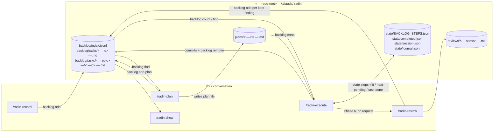
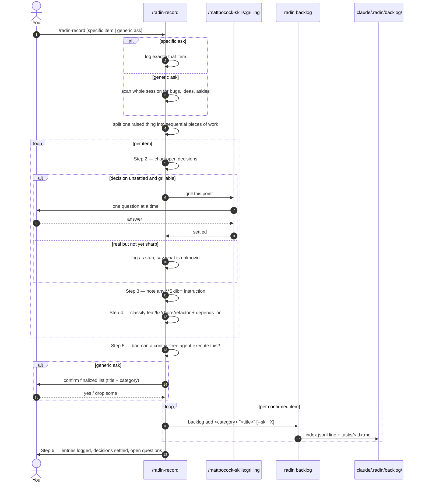
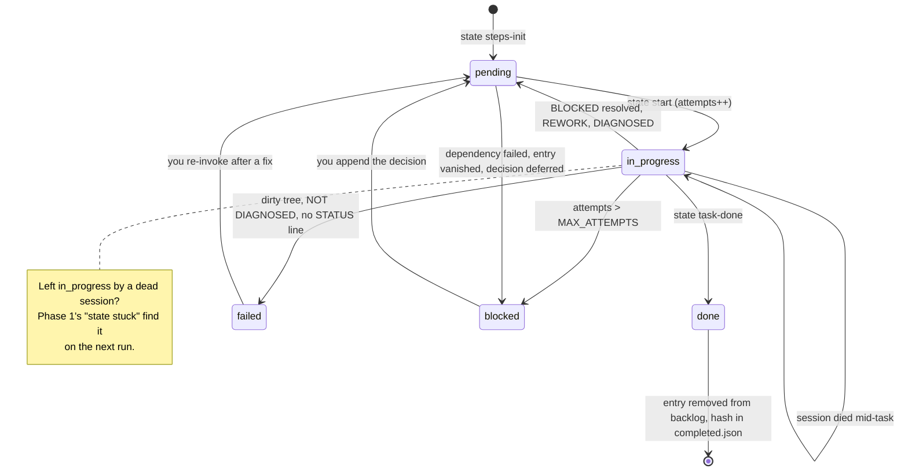
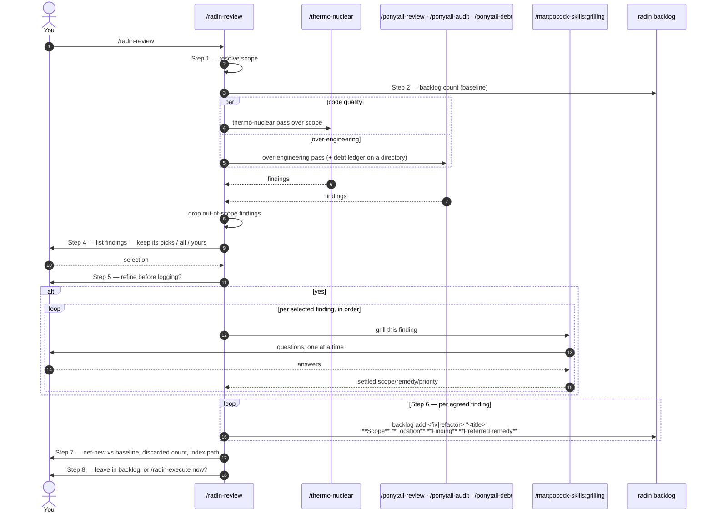

<p align="center">
  <strong>🐀 radin</strong>
</p>

<p align="center">
  <em>Too cheap pay full price whole AI tool stack — so went shopping for you.</em>
</p>

<p align="center">
  <sub>"Radin" French slang for miser. Hence rat.</sub>
</p>

<p align="center">
  <a href="LICENSE"></a>
  <a href="AGENTS.md"></a>
  <a href="CHANGELOG.md"></a>
</p>

<p align="center">
  <a href="#install">Install</a> ·
  <a href="#tools-you-get">Tools you get</a>
</p>

---

## What is radin

radin is a Claude Code plugin for the solo dev on a small Claude
subscription. One `curl | bash` installs two things:

1. **A backlog-driven workflow.** Skills that record tasks as files in your
   repo, plan them, execute them one commit at a time, and review the result.
   Every task survives past the conversation, every run resumes where it
   stopped.
2. **A curated set of token-reduction tools.** rtk, caveman, ponytail,
   codebase-memory-mcp, headroom, thermo-nuclear, mattpocock-skills. All of
   them, no per-tool question. radin's skills delegate to these instead of
   reimplementing them, so a half-installed stack is the one case they can't
   rely on. Each stays its own project: radin never forks or vendors them, it
   shops.

The goal: stretch a small subscription further. Fewer tokens per task, and
agent runs that are resumable and verifiable instead of fire-and-forget.

## Install

### Requirements

radin itself only copy files. Companion tools pull own stacks, each through
its own installer. A tool whose installer fails is reported and skipped.
radin's own install never aborts for it.

| For | You need |
| --- | --- |
| radin core (skills) | `curl`, `tar`, `bash` |
| Claude plugins (caveman, ponytail, mattpocock-skills) | `claude` CLI |
| rtk | [Homebrew](https://brew.sh), or `curl` for rtk's own installer |
| codebase-memory-mcp | `curl` for its own installer (static binary, no runtime). `python3` to bracket its `~/.claude` write — without it, radin installs binary only |
| headroom | `python3` with `pip3` or [`pipx`](https://pipx.pypa.io) |

Homebrew optional. When present, radin use it for `rtk`. Not required on Linux.

> **Homebrew Python note (macOS).** Broken `python@3.14` bottle can make
> every `pip`/`pipx` install fail with `pyexpat` / `libexpat` symbol error.
> `install.sh` detect this, print fix: `brew reinstall
> --build-from-source python@3.14`. Plain `brew reinstall` reinstall
> same broken bottle — `--build-from-source` flag relinks Python
> against Homebrew's `expat`.

```sh
# macOS · Linux · WSL
curl -fsSL https://raw.githubusercontent.com/shortcuts/radin/main/install.sh | bash
```

Install asks three questions, all about how `radin-execute` behaves:
concurrency, refuter pass, sub-agent models. Everything else installs.
`--yes` skips the three and takes their defaults, for a non-interactive
machine.

```sh
curl -fsSL https://raw.githubusercontent.com/shortcuts/radin/main/install.sh | bash -s -- --yes
```

## Update

```sh
radin update
```

One command for the whole stack: radin's own skills and lib scripts, plus
every companion tool. It pulls a dev clone (only when clean and
fast-forwardable) or downloads the newest release, then re-runs `install.sh`
in update mode. No question is asked again — concurrency, refuter pass and
sub-agent models come from `~/.claude/.radin/manifest.json`, which the last
install wrote.

Nothing is deleted: the installer only copies its own files over, companion
tools go through their own upgrade path, and `radin cbm-config install`
re-brackets upstream's destructive config write.

Without the CLI on PATH, the same run is:

```sh
curl -fsSL https://raw.githubusercontent.com/shortcuts/radin/main/install.sh | bash -s -- --update
```

`--force` updates companion tools but keeps asking the three questions.

## Drive it yourself: `radin tui`

```sh
radin tui
```

Full-screen backlog browser, for when you want no agent in the loop. Lists
every task grouped by category, previews the selected one, and gives you one
key per operation:

| Key | Does |
| --- | --- |
| `j` `k`, arrows | Move, `g`/`G` jump to first/last |
| `enter`, `e` | Edit task body in `$EDITOR` |
| `v` | View task body in `$PAGER` |
| `n` | New task: one key for category, a title, then body in `$EDITOR` |
| `d` | Delete selected task, after a `y` confirmation |
| `c` | Move task to next category |
| `r` | Retitle task — its id never changes, so plans and `depends_on` still point at it |
| `/` | Filter by id or title, empty clears |
| `R` `?` `q` | Reload, keys, quit |

A `P` in the first column means `/radin-plan` already wrote a plan for that
task.

Same backlog the skills use, same CLI underneath — every key shells out to
`radin backlog`. Zero dependencies too: raw ANSI and `stty`, no `tput`,
`dialog`, `gum` or `fzf`. It needs a real terminal, so it refuses to run in a
pipe; use `radin backlog show` there.

## The backlog lifecycle

Repo's backlog live inside repo, at `.claude/.radin/backlog/`
from repo root: index file plus one markdown file per task. Related tasks
group under an epic — `backlog/tasks/<epic-id>/`, where `DESCRIPTION.md` hold
context every child task inherit, wrote once instead of repeat in each task.
Epic get no index row and no category, so no tool ever mistake one for task.
Manage with `radin backlog epics`, `epic-add`, `epic-move`, `epic-remove`, or
`radin backlog add <category> "<title>" --epic <epic-id>`. Every
radin tool read from or write to it through radin's own CLI (`radin backlog`, `radin state`, `radin update`, ... — symlinked into `~/.local/bin` at install), never need look inside. Run `/radin-show` read it as plain markdown.
Commit `.claude/.radin/` share backlog with team, or add to
`.gitignore` keep private. Radin never touch your `.gitignore`
either way.

Typical flow:

1. **Capture.** Something come up mid-session — bug, idea, feedback
   from teammate. Run `radin-record` turn it into backlog entry.
2. **Plan (optional).** Point `radin-plan` at one entry write
   step-by-step plan for it, without touching any code. Repeat per entry you
   want planned ahead of time.
3. **Execute.** Run `radin-execute` work through backlog,
   entry by entry, committing as it goes.
4. **Review.** Run `radin-review` against commit, PR, or directory. It shows
   findings, asks which to keep, then each kept one become new backlog entry,
   ready for next pass of step 3.

### How the four skills connect

Every skill run in your own conversation, so it can ask you questions. Only
leaf work go to sub-agents. Disk is the handoff: nothing pass through
conversation context.



### Capture: `/radin-record`

One gate matters here: you are at the keyboard now, and `radin-execute` may
later run with nobody behind it. So every judgment call get settled at record
time, or get written down plainly as open.



Entry body carry its own context: what was being worked on, `**Raised as:**`
verbatim quote of any error string or path, one `**Decision:**` line per
settled call. Never merged with existing entry — false-positive merge lose
something you cared about.

### Execute: `/radin-execute`

The loop. Phases 0 through 3 run once, Phase 4 run per task, Phase 5 always
run. Every state change hit disk the moment it happens, so interrupting cost
nothing: re-invoke resume, finished tasks never redone.

```mermaid
sequenceDiagram
    autonumber
    actor U as You
    participant E as /radin-execute
    participant CLI as radin backlog / state
    participant P as Planning sub-agent
    participant X as Execution sub-agent
    participant V as Refuter sub-agent
    participant D as Debug sub-agent
    participant F as Fact-finder sub-agent

    U->>E: /radin-execute
    Note over E: Phase 0 — resolve namespace
    E->>CLI: backlog env --export, backlog count

    Note over E: Phase 0.5 — worktree/branch preference
    E->>CLI: state session-get
    alt already answered
        CLI-->>E: worktree/branch (ask nothing)
    else no answer yet
        E->>E: defer both questions to Phase 2's single call
    end

    Note over E: Phase 1 — read and prioritize
    E->>CLI: backlog reconcile completed.json
    E->>CLI: state stuck BACKLOG_STEPS.json
    alt stuck tasks found
        E->>E: read radin-execute-recovery.md, follow per id
    end
    E->>E: prioritize per radin-prioritization.md, assign order 1..n

    Note over E,U: Phase 2 — MANDATORY GATE (never pre-answered by a prompt)
    E->>U: AskUserQuestion: confirm order? which tasks now?<br/>(+ worktree/branch if unanswered)
    U-->>E: answers
    alt order rejected
        E->>E: apply revision, re-prioritize, ask again
    end
    E->>CLI: state session-set (if asked)

    Note over E: Phase 3 — persist plan
    E->>CLI: state steps-init (id, order, depends_on)

    loop Phase 4 — per task, until next-pending exits 1
        E->>CLI: state next-pending
        E->>CLI: state deps-check (Step 4a-0)
        alt dependency unresolved
            E->>CLI: state set-status blocked
            E->>E: skip to next task
        end

        E->>CLI: backlog find + backlog meta (Step 4a)
        alt plan pointer exists
            E->>E: use plan(s) on disk
        else no plan
            E->>E: /ponytail:ponytail ladder — straightforward?
            alt straightforward
                E->>E: implement directly from entry text
            else needs a plan
                E->>P: Planning prompt (TASK_ID)
                P-->>E: STATUS: PLANNED | BLOCKED (FACT|DECISION)
            end
        end

        E->>CLI: state start (Step 4b — claim on disk, bump attempts)
        alt attempts > MAX_ATTEMPTS
            CLI-->>E: exit 2, already marked blocked
        end
        E->>X: Execution prompt (TASK_FILE, PLAN_PATHS, CATEGORY,<br/>NAMESPACE_DIR, TASK_ID, SKILLS, DEPENDS_ON)
        Note over X: runs state prepare for its own tree,<br/>implements via /caveman discipline skill,<br/>commits with /caveman-commit
        X-->>E: STATUS line

        E->>CLI: state task-dir + state dirty-check
        alt tree dirty whatever the STATUS
            E->>CLI: state stash
            E->>CLI: state set-status failed (stash ref in note)
            E->>U: ⚠️ reported <STATUS> but left dirty tree
        else clean tree
            alt STATUS: SUCCESS
                opt refuter pass enabled at install
                    E->>V: Refuter prompt (diff only, never X's report)
                    Note over V: reruns repo checks itself,<br/>invokes /radin-review for taste findings
                    V-->>E: VERDICT: ACCEPT | REWORK | UNVERIFIED
                    alt REWORK
                        E->>CLI: backlog append **Rework:** must-fixes
                        E->>E: re-run task from Step 4b
                    end
                end
                E->>CLI: state task-done (hash to completed.json,<br/>entry out of backlog, line out of steps)
                E->>U: ✅ Task complete. Remaining: n
            else STATUS: BLOCKED (FACT)
                E->>F: Fact-finding prompt (read-only)
                F-->>E: STATUS: FOUND | NOT FOUND
                alt FOUND
                    E->>CLI: backlog append **Fact:** / **Facts:** path
                    E->>E: retry from Step 4a
                else NOT FOUND
                    E->>E: fall through to BLOCKED (DECISION)
                end
            else STATUS: BLOCKED (DECISION)
                E->>U: question + options + recommendation first
                alt you decide
                    U-->>E: answer
                    E->>CLI: backlog append **Decision:**
                    E->>E: retry from Step 4a
                else you defer
                    E->>CLI: state set-status blocked (question in note)
                    E->>U: ⏸️ deferred. Continuing.
                end
            else STATUS: FAILED
                E->>D: Debug prompt — once per task per session
                D-->>E: STATUS: DIAGNOSED | NOT DIAGNOSED
                alt DIAGNOSED
                    E->>CLI: backlog append **Root cause:**
                    E->>E: re-run from Step 4b (attempts cap still ends it)
                else NOT DIAGNOSED
                    E->>CLI: state set-status failed
                    E->>U: ❌ failed: reason. Continuing.
                end
            else no STATUS line at all
                E->>CLI: state set-status failed (interactive skill<br/>or spawned background task)
            end
        end
    end

    Note over E: Phase 5 — final summary (always runs)
    E->>E: read radin-execute-reporting.md
    E->>U: per-task outcome, where commits landed,<br/>deferred/blocked/failed, dropped skills

    Note over E: Phase 6 — review
    alt you asked for a session review
        E->>E: dispatch reviewer sub-agent over the session's commits
    else
        E->>U: "run /radin-review with scope: <hashes>"<br/>(or: each task already refuted)
    end
```



A task's status live in `state/BACKLOG_STEPS.json` and only the state CLI
write it:



Only `done` remove entry from backlog. `failed` and `blocked` stay for you to
retry or decide later, and never block loop from reach Phase 5.

### Review: `/radin-review`

Findings go to backlog, not to your terminal — nothing logged without your
agreement.



## Tools you get

### Homemade

| Tool | What it does |
| --- | --- |
| `radin-execute` | Chews through backlog, one task at time, commits as it goes |
| `radin-plan` | Writes plan for one backlog entry you point it at, instead of touching code |
| `radin-review` | Strict code-quality pass, findings triaged with you then logged into backlog |
| `radin-record` | Logs feedback/bugs/ideas raised mid-session as backlog entries |
| `radin-show` | Prints current project's backlog |
| `radin tui` | Full-screen backlog browser for humans — CLI subcommand, not a skill, no agent invokes it |
| `radin-doctor` | Checks radin's own install complete, reports which companion tools reachable |
| `radin-setup-hooks` | Fallback per-repo wiring for codebase-memory-mcp, when `install.sh` could not wire it globally |
| `radin-stats` | Shows each installed companion tool's own stats/gain output, side by side |
| `radin-uninstall` | Removes everything `install.sh` added to `~/.claude` |

Some delegate to other skills instead of reimplementing review or
style logic themselves:

| Tool | Delegates to |
| --- | --- |
| `radin-execute` | `/ponytail` (plan-or-skip gate), `/radin-plan` (tasks judged complex enough), `/caveman:surgical-patch` (a `fix`), `/caveman:safe-refactor` (a `refactor`), `/caveman:lean-build` (a `feat`), `/caveman-commit` (commit message), `/mattpocock-skills:diagnosing-bugs` (a failed attempt), `/radin-review` (end-of-session review) |
| `radin-plan` | `/ponytail` (split judgment and plan writing), `/mattpocock-skills:codebase-design` (module boundaries), `/mattpocock-skills:research` (third-party behavior), `/thermo-nuclear` + `/ponytail-review` (reviewing plan itself before handoff) |
| `radin-review` | `/thermo-nuclear` (code-quality pass), `/ponytail-review` or `/ponytail-audit` (over-engineering pass), `/ponytail-debt` (deferred shortcuts, directory scope) |
| `radin-stats` | `caveman-stats`, `rtk gain`, `headroom savings`, `ponytail-gain`, `ponytail-debt` |

#### `radin-record`

Log something raised mid-conversation, before lost.

```
/radin-record log the auth timeout bug we just found
```

Result: new `fix`-classified task added to backlog, bug
described enough detail future session act on it, no other
context needed.

#### `radin-plan`

Write plan for one backlog entry, without writing any code. Judges
whether entry's scope should split into multiple independent plans,
confirms with you before splitting.

```
/radin-plan the auth timeout bug
```

Result: one plan file per plan under `.claude/.radin/plans/` at repo
root (more than one if entry split). Each plan reviewed with
`/thermo-nuclear` and `/ponytail-review` before handoff, findings
fixed directly in plan file, `**Plan:** <path>` line appended to
task's own backlog file per plan produced.

#### `radin-execute`

Work through backlog end to end: prioritize, implement, test, commit —
one entry at time. Uses existing plan from `radin-plan` if entry
already has one. If not, asks `/ponytail` whether task straightforward
enough implement directly. Only tasks judged genuinely
complex go through `/radin-plan` first.

```
/radin-execute
```

Result: each entry implemented and committed in its own commit.

Runs in your own conversation, so it asks you to confirm the execution order
before it starts, and you can interrupt it. Every task's state is on disk, so
re-running `/radin-execute` resumes where it stopped and never redoes finished
work.

Want your thread free while the backlog runs? Two ways:

- **`claude agents`** — dispatch `/radin-execute` as a background session,
  then peek, reply, or attach whenever you like. Each one is a full Claude
  Code conversation, so nothing about the skill changes. `/bg` sends the
  conversation you're already in over there instead.
- **A second `claude` session** in another terminal. Same thing, one window
  per run.

Either way the worktree-per-task answer keeps concurrent runs off each
other's checkout.
Finished entries removed from backlog; failed ones stay, marked
for retry. Ask for an end-of-session review and it runs `/radin-review` over
the session's commits, logging findings back to backlog as new entries.

#### `radin-review`

Run strict quality review over chosen scope, then log findings to
backlog instead of printing to terminal. Nothing logged without your
agreement: skill lists findings, asks which to keep (its picks, all, or
yours), then offers refinement pass that grills each kept finding via
`/mattpocock-skills:grilling` before write.

```
/radin-review #123
```

Also accepts commit hash, directory path, or natural-language range
like `"commits since Monday"`. Result: one backlog task per kept finding,
classified as `fix` (real bug) or `refactor` (structural).

#### `radin-setup-hooks`

Fallback wiring. Most installs never need it: `install.sh`
installs whole tool — its skill, three graph agents, hooks that route
Grep/Glob to graph, and user-scope MCP entry that makes every repo work with
no per-project step.

radin wraps that write (`radin cbm-config install`) because upstream
[#1200](https://github.com/DeusData/codebase-memory-mcp/issues/1200) replaces
whole `SessionStart` array in `~/.claude/settings.json` instead of merging,
which drops caveman's and ponytail's own hooks. radin snapshots
`settings.json` + `~/.claude.json` into `~/.claude/.radin/backups/` first,
runs their installer, then puts back every entry that write dropped. One
`RESTORED`/`INTACT` line per item.

```
/radin-setup-hooks
```

Run it only when:

- `python3` was missing at install time. radin then installs binary only and
  skips upstream's config, because it cannot restore what that write drops.
- You ran `codebase-memory-mcp uninstall` but kept radin.

It writes graph section in `~/.claude/CLAUDE.md` plus MCP server entry in
repo's `.mcp.json`, merge-only: anything already defined never redefined.
Names exact writes, asks confirmation first.

##### Caveats worth knowing

- **After `codebase-memory-mcp update`, run `radin cbm-config repair`.** Its
  update reruns same destructive config write. `repair` restores from newest
  snapshot in `~/.claude/.radin/backups/`.
- **`repair` restores, it does not undo.** It puts back what newest snapshot
  held and is now missing. Hook you deliberately deleted after that snapshot
  comes back. Undo upstream's side with `codebase-memory-mcp uninstall`.
- **Only Claude Code's two files are bracketed.** Upstream configures 45
  client surfaces (Cursor, Codex, Gemini CLI, OpenCode...). radin snapshots
  `~/.claude/settings.json` and `~/.claude.json` only. Other clients' configs
  get upstream's write unbracketed — back them up yourself first.
- **Symlinked `~/.claude` works, through a workaround.** Upstream refuses every
  write under a symlinked config directory and exits 0 having configured
  nothing for Claude Code
  ([#1722](https://github.com/DeusData/codebase-memory-mcp/issues/1722)).
  radin resolves the link, passes it as `CLAUDE_CONFIG_DIR`, and moves the MCP
  entry that override stages in `<real-dir>/.claude.json` into
  `~/.claude.json`. The staged file is left behind — radin deletes nothing it
  did not write. If you export your own `CLAUDE_CONFIG_DIR`, radin passes
  nothing and upstream uses yours.
- **Snapshots hold your real config.** `settings.json` can carry `env` values
  and hook commands. Snapshots are plain copies in
  `~/.claude/.radin/backups/`, never deleted by radin, never committed
  anywhere. Delete them yourself when done.
- **`/radin-uninstall` leaves upstream's side alone.** Its skill, agents and
  hooks under `~/.claude` are upstream's, not radin's:
  `codebase-memory-mcp uninstall` removes those.
- **`.mcp.json` entry written by `radin cbm-hooks mcp` is machine-specific.**
  It points at resolved binary path (`~/.local/bin/codebase-memory-mcp`).
  Don't commit it to a shared repo — a teammate on a different path gets a
  dead MCP server.
- **First query on a big repo waits for first index.** `auto_index` indexes on
  first connection; cap it with
  `codebase-memory-mcp config set auto_index_limit <files>`.
- **`detect_changes` reads working tree, not arbitrary commit.** For commit or
  PR scope, check it out (or diff it) first — `/radin-review` says so too.
- **Graph answer is a pointer, not proof.** Empty result never proves absence.
  Read file before editing. Every radin prompt that names graph tool repeats
  this.

### Shopped for you

`install.sh` installs every one through its own installer — never forked,
never vendored, own repo stays source of truth.

| Tool | What it does |
| --- | --- |
| [rtk](https://github.com/rtk-ai/rtk) | CLI proxy reduces LLM token consumption 60-90% on common dev commands. Single Rust binary, zero dependencies |
| [caveman](https://github.com/JuliusBrussee/caveman) | Why use many token when few token do trick — Claude Code skill cuts 65% of tokens by talking like caveman |
| [ponytail](https://github.com/DietrichGebert/ponytail) | Makes AI agent think like laziest senior dev in room. Best code is code never written |
| [codebase-memory-mcp](https://github.com/DeusData/codebase-memory-mcp) | Code intelligence MCP server. Indexes repo into persistent knowledge graph (158 tree-sitter grammars, sub-ms queries) so agent asks graph instead of grepping files. Single static binary, no runtime. Installed with `--skip-config` — radin owns every `~/.claude` write |
| [headroom](https://github.com/headroomlabs-ai/headroom) | Local-first context-compression stack — proxy/MCP/wrap layer with cross-agent memory and CLAUDE.md-learning. Complements rtk (whole-session wrap vs. rtk's per-command compression), not replacement. Python/pip footprint, so `install.sh` probes `python3` first and skips it on a broken one |
| [thermo-nuclear](https://github.com/cursor/plugins/tree/main/cursor-team-kit/skills/thermo-nuclear-code-quality-review) | Code quality review skill, vendored from cursor/plugins at install time via [vercel-labs/skills](https://github.com/vercel-labs/skills) CLI |
| [mattpocock-skills](https://github.com/mattpocock/skills) | Engineering skills plugin (`claude-plugins-official` marketplace) — `radin-plan` and `radin-review` delegate interview step to `/grilling`, `radin-plan` sends API/library fact-checking to `/research` instead of reimplementing them |

---

Maintaining or hacking on radin itself? See [AGENTS.md](AGENTS.md) and
[CONTRIBUTING.md](CONTRIBUTING.md).
